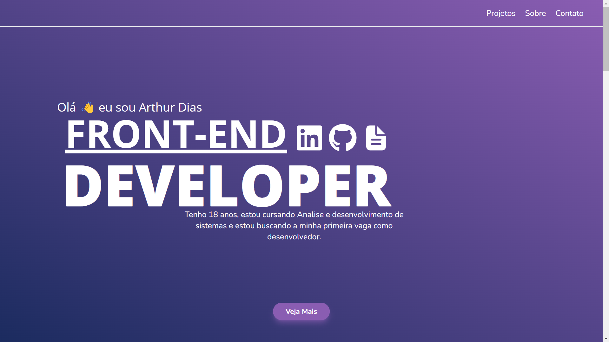

[JAVASCRIPT__BADGE]: https://img.shields.io/badge/JavaScript-F7DF1E?logo=javascript&logoColor=000
[REACT__BADGE]: https://img.shields.io/badge/React-%2320232a.svg?logo=react&logoColor=%2361DAFB
[TAILWINDCSS__BADGE]:https://img.shields.io/badge/Tailwind%20CSS-%2338B2AC.svg?logo=tailwind-css&logoColor=white
[HTML__BADGE]: https://img.shields.io/badge/HTML-%23E34F26.svg?logo=html5&logoColor=white
[CSS__BADGE]: https://img.shields.io/badge/CSS-1572B6?logo=css3&logoColor=fff
[PROJECT__BADGE]: https://img.shields.io/badge/📱Visit_this_project-000?style=for-the-badge&logo=project
[PROJECT__URL]: free-to-fun.vercel.app

<h1 align="center" style="font-weight: bold;">PORTIFÓLIO 💻</h1>

![javascript][JAVASCRIPT__BADGE]
![react][REACT__BADGE]
![TailwindCSS][TAILWINDCSS__BADGE]
![html][HTML__BADGE]
![css][CSS__BADGE]

<p align="center">
 <a href="#about">Sobre</a> • 
 <a href="#started">Primeiros Passos</a> • 
  <a href="#routes">Rotas</a> 
</p>


<p align="center">
    
</p>

<h2 id="about">📌 Sobre</h2>


Este projeto é um portfólio, que tem como objetivo  apresentar de forma interativa e atrativa os projetos realizados, demonstrando habilidades em desenvolvimento e atenção aos detalhes em cada criação. A estrutura do portfólio destaca seções informativas que evidenciam os projetos desenvolvidos, as tecnologias empregadas.

[![visit this project][PROJECT__BADGE]][PROJECT__URL]


<h2 id="started">🚀 Primeiros Passos</h2>


Para executar este projeto localmente, siga as etapas abaixo. Certifique-se de ter o Node.js e o npm ou yarn instalados em sua máquina.

<h3>Pré-requisitos</h3>


- [NodeJS](https://nodejs.org/en)
- [Git](https://git-scm.com/downloads)

<h3>Clonando</h3>
Para clonar o projeto em sua maquina cexecute o código abaixo:

```bash
git clone https://github.com/ArthurDias26/Portfolio.git
```

<h3>Começando</h3>

Após clonar o projeto abra um terminal e execute o código abaixo:

```bash
cd Portfolio
npm install
npm start
```

<h2 id="routes">📍 Rotas</h2>


| route               | description                                          
|----------------------|-----------------------------------------------------
| <kbd>/src/assets</kbd>     | Pasta com os recursos externos necessários, como imagens, fontes e estilos.
| <kbd>/src/components/sections</kbd>     | Pasta contendo todos os componentes das seções da aplicação.
| <kbd>/src/components/layout</kbd>     | Pasta com todos os componentes reutilizáveis ​​usados ​​nas páginas.
<kbd>/src/App.js</kbd>     | Arquivo principal onde o roteamento das paginas é feito
| <kbd>/src/utilis</kbd>     | Folder containing React Router routing and additional functionalities.
